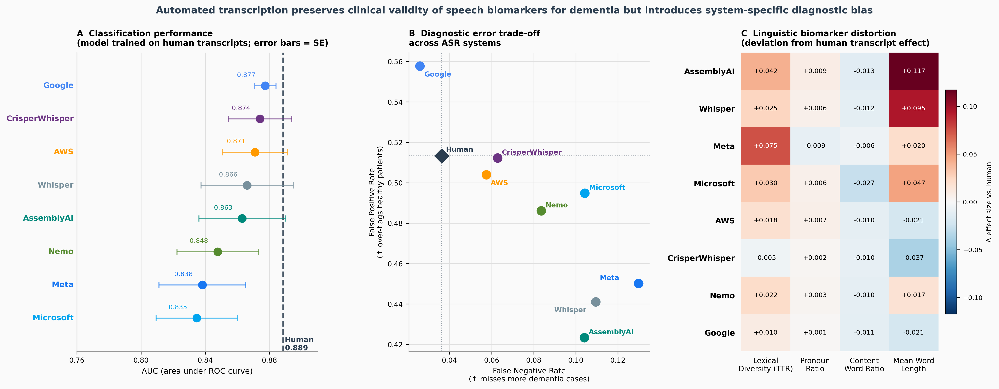

# Clinical Validity of Speech Biomarkers for Dementia Across Automated Transcription Systems

> **Automated transcription preserves clinical validity of speech biomarkers for dementia but introduces system-specific diagnostic bias**

## Overview

This repository contains the analysis code, statistical scripts, and results for a study evaluating the clinical validity of speech-based dementia detection when models trained on human transcripts are applied to transcripts generated by automatic speech recognition (ASR) systems.

Using 306 speech recordings from older adults with and without dementia, we evaluated eight state-of-the-art ASR systems across three experiments:

- **Experiment 1** — Dementia classification performance (AUC) across 9 transcript sources
- **Experiment 2** — Diagnostic error profiles: false negative and false positive rates per ASR system
- **Experiment 3** — Linguistic biomarker distortion: deviation in effect sizes relative to human transcripts

## Summary Figure



**A.** Classification performance (AUC) when a model trained on human transcripts is evaluated on human and ASR-generated transcripts. Error bars = standard error across cross-validation folds.
**B.** Diagnostic error trade-off across ASR systems (false negative rate vs. false positive rate).
**C.** Linguistic biomarker distortion — deviation in effect size relative to human transcripts for TTR, pronoun ratio, content-word ratio, and mean word length.

## Key Findings

- Classification performance remained close to the human baseline (AUC = 0.889) across all ASR systems, with the best-performing ASR achieving AUC = 0.877 (Google)
- Despite similar overall performance, ASR systems produced substantially different diagnostic error profiles
- All four linguistic biomarkers showed significant Group × Transcription Source interactions (all p < 0.001), indicating system-specific distortion of clinically relevant signals
- Transcription accuracy (WER) alone is insufficient to evaluate ASR systems for clinical deployment — downstream clinical validity must be assessed

## ASR Systems Evaluated

| System | Type |
|---|---|
| Google Speech-to-Text | Commercial |
| AWS Transcribe | Commercial |
| Microsoft Azure | Commercial |
| AssemblyAI | Commercial |
| Meta MMS | Open-source |
| OpenAI Whisper | Open-source |
| CrisperWhisper | Open-source |
| NVIDIA NeMo | Open-source |

## Repository Structure

```
├── data/                          # Experiment result files
│   ├── Transcription.csv              # Human and ASR-generated transcripts
│   ├── exp1_filewise_predictions_long.csv
│   ├── exp2_error_rates_summary_vs_human.csv
│   ├── exp2_fold_source_error_rates.csv
│   ├── exp3_biomarker_distortion.csv
│   ├── exp3_filewise_predictions_long.csv
│   └── transcript_length_summary.csv
├── stats/
│   ├── Exp1.R                     # Mixed-effects model: classification probability
│   ├── Exp2.R                     # Mixed-effects model: FNR and FPR
│   ├── Exp3.R                     # Mixed-effects model: biomarker distortion
│   └── results/                   # Exported R model outputs
│       ├── exp1/
│       ├── exp2/
│       └── exp3/
└── figures/
    └── Figure2_summary.png        # Main results figure
```

## Data

Speech transcripts (human and ASR-generated) are included in `data/Transcription.csv`. Audio recordings are not publicly available due to participant privacy. Access can be requested through the corresponding author.

## Requirements

```r
install.packages(c("tidyverse", "lme4", "lmerTest", "emmeans", "broom.mixed"))
```

## License

Code is released under the MIT License. Data files are shared for research reproducibility only and may not be redistributed without permission.

## Contact

- Thayabaran Kathiresan — thayabaran.kathiresan@unimelb.edu.au
- Adam P. Vogel — vogela@unimelb.edu.au
